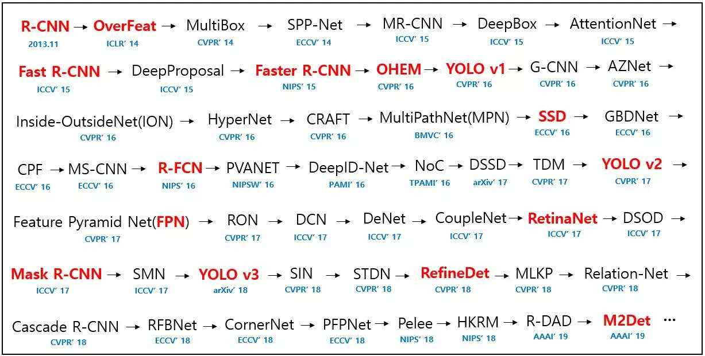
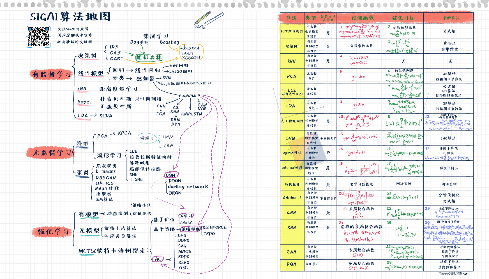
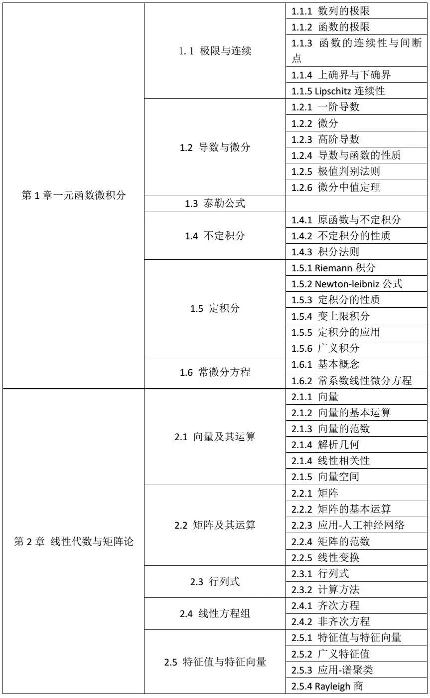

## Algorithm Taxonomy

<embed src="./pdfs/picssuper-cheatsheet-deep-learning.pdf" width="850" height="600">

<iframe src="http://docs.google.com/gview?url=https://crazydogen.github.io/src/pdfs/super-cheatsheet-deep-learning.pdf&embedded=true" style="width:300px; height:100px;" frameborder="0"></iframe>

*   to be continued
